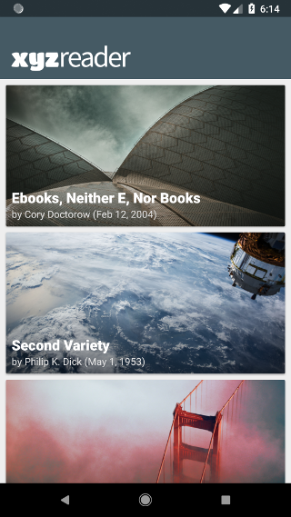
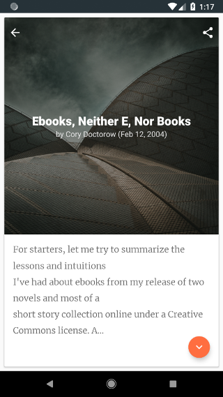

# XYZreader
A mock RSS reader with a set of headline photos and sample text content. The app was redesigned from scratch, and bugfixes were applied to the backend (see link to the original code in **Credits**).

*Fourth project for [Udacity's Android Developer Nanodegree Program](https://eu.udacity.com/course/android-developer-nanodegree-by-google--nd801) (built in partnership with Google).*

## Built with
- Custom `Merriweather-Light` font.
- `CoordinatorLayout`, `AppBar`, `CollapsingToolbar` to collapse and pin the toolbar on scroll.
- `FAB` for collapsing/expanding long texts.
- Slide in animations for action bar icons, fade in animation for subtitles, and on click rotate animation for `FAB`.

## Screen captures
Home screen|Details screen
-----------|----------------
|

Overview (GIF)|
--------------|
|

## Credits
[Udacity](https://github.com/udacity/xyz-reader-starter-code) - original code and design. 
[Eben Sorkin](https://github.com/EbenSorkin/Merriweather) - `Merriweather` font. Licence can be found [here](LICENCE_FONT).

## Licence
This project is licensed under the MIT Licence - see the [LICENCE](LICENCE) file for details.